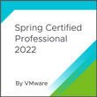

# 🤓 Introduction 
I'm a Software Developer Specialist with 11+ years of professional experience, mostly in back-end development. My expertise comes primarily from working with Java projects based on the Spring framework, and JavaScript and TypeScript projects based on Node.js. I have extensive hands-on building cloud-native applications (mainly on AWS), SQL and NoSQL database management, managing of containerized workloads and services with Docker and Kubernetes, messaging and stream processing with Kafka as well as proficiency in conducting DevOps tasks such as CI/CD pipeline management and configuration, integration with monitoring and performance tools, among other related activities. More recently I'm getting used to Golang on discovering its capabilities.

 

# 🎓 Certifications ([Credly](https://www.credly.com/users/david-archanjo))
| | | | | |
| :-: | :-: | :-: | :-: | :-: |
||||||
||||||
||||||

 

# 👨‍💻 Contacts
If you want to reach me or check more informations about me, my work etc, follows:
- [LinkedIn](https://www.linkedin.com/in/davidarchanjo/)
- [Email](mailto:david.archanjoybr@gmail.com)
- [WhatsApp](https://api.whatsapp.com/send?phone=5511976375264)
- [Telegram](https://t.me/davidarchanjo)
