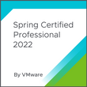
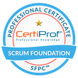
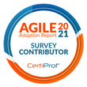
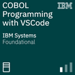
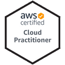
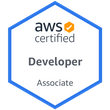
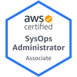
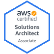
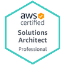
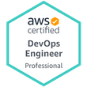

# 🤓 Introduction 
Senior Full-Stack Software Engineer with extensive experience designing and building scalable cloud-based applications across financial services, healthcare, and enterprise platforms.
 
My background combines strong backend engineering with modern frontend development and cloud architecture. I specialize in Java and Spring-based distributed systems, microservices architectures, and high-availability APIs running in containerized environments and cloud platforms such as AWS.
 
I also work extensively with Python and modern JavaScript frameworks (Angular and React) to deliver end-to-end solutions—from backend services and infrastructure to user-facing applications.
 
I have been exploring applied AI development, building practical systems around open-source LLMs and inference frameworks. This includes designing local and cloud inference stacks (vLLM, Ollama), RAG pipelines, and AI development tooling integrated with production applications.
 
Core areas of expertise include:
- Backend engineering (Java, Spring Boot, REST APIs, microservices)
- Full-stack development (Angular, React, modern JavaScript/TypeScript)
- Cloud and DevOps (Docker, Kubernetes, AWS, containerization, CI/CD pipelines)
- Distributed systems and scalable backend architecture
- Python development and AI integration workflows
- LLM inference infrastructure, RAG pipelines, and AI developer tooling

Open to international opportunities and relocation. Willing to relocate and complete visa processes where required.
  

# 🎓 Certifications
| | | | | |
| :-: | :-: | :-: | :-: | :-: |
||||||
||||||
||||||

To check all my achivement, go to my [Credly](https://www.credly.com/users/david-archanjo) dashboard.
 

# 👨‍💻 Contacts
If you want to reach me or check more informations about me, my work etc, follows:
- [LinkedIn](https://www.linkedin.com/in/davidarchanjo/)
- [Email](mailto:david.archanjoybr@gmail.com)
- [WhatsApp](https://api.whatsapp.com/send?phone=5511976375264)
- [Telegram](https://t.me/davidarchanjo)
