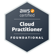

# 🤓 Introduction 
I am a full-stack software engineer with more than 12 years of professional activity. My experience comes from working with Java projects using the Spring framework for backend development, as well as Node.js web projects using JavaScript and TypeScript for frontend development with the Angular and React.js frameworks, and for backend development with the Express.js and NestJS frameworks, among others. 
My technical experience also spans across other areas, including modeling, manipulation and integration of SQL databases such as Oracle, PostgreSQL and MySQL, and of NoSQL databases such as DynamoDB and MongoDB; integration with messaging systems like Kafka and RabbitMQ; containerization and application orchestration with Docker and Kubernetes; development of serverless applications on AWS; and DevOps practices such as creating CI/CD pipelines, integration with APM tools for observability and service monitoring purposes.
 

# 🎓 Certifications
| | | | | |
| :-: | :-: | :-: | :-: | :-: |
||||||
||||||
||||||

To check all my achivement, go to my [Credly](https://www.credly.com/users/david-archanjo) dashboard.
 

# 👨‍💻 Contacts
If you want to reach me or check more informations about me, my work etc, follows:
- [LinkedIn](https://www.linkedin.com/in/davidarchanjo/)
- [Email](mailto:david.archanjoybr@gmail.com)
- [WhatsApp](https://api.whatsapp.com/send?phone=5511976375264)
- [Telegram](https://t.me/davidarchanjo)
