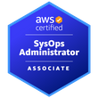

# 🤓 Introduction 
I am Brazilian, proudly addicted to coffee ☕, who doesn't huh!?, and father of two beautiful little girls 👶👧. As a professional software engineer, I have been working with SDLC for over 12 years and have recently being involved in activities related to cloud-driven development and DevOps routines, always focused on specializing myself in the best practices and most productive ways to build and architect applications — mostly in Java combined with the Spring Framework ecosystem. I have also been following with great enthusiasm the arising and evolution of new technologies optimized for the cloud that use new generations of the JVM, such as [Quarkus](https://quarkus.io/) and [GraalVM](https://www.graalvm.org/).

# 🎓 Certifications
## AWS

## CertiProf

## Postman

## Java

## IBM

# 📫 How to Reach Me
- [LinkedIn](https://www.linkedin.com/in/davidarchanjo/)
- [Email](mailto:david.archanjoybr@gmail.com)
- [WhatsApp](https://api.whatsapp.com/send?phone=5511976375264)
- [Telegram](https://t.me/davidarchanjo)
