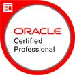
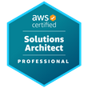

# 🤓 Introduction 
I am a full-stack software engineer with over 12 years of professional activity. My experience comes mostly from working with Java projects using the Spring framework for backend development, and from Node.js web projects using JavaScript and TypeScript for frontend development with the Angular framework as well as for backend development with the Express.js and NestJS frameworks. I also have extensive hands-on experience in tasks like modeling, manipulation and integration of SQL and NoSQL databases; integration with messaging system like Kafka and RabbitMQ; containerization and application workload with Docker and Kubernetes; serverless application development on AWS; and DevOps practices like CI/CD pipeline, observability and monitoring.
 

# 🎓 Certifications
| | | | | |
| :-: | :-: | :-: | :-: | :-: |
||||||
||||||
||||||

To check all my achivement, go to my [Credly](https://www.credly.com/users/david-archanjo) dashboard.
 

# 👨‍💻 Contacts
If you want to reach me or check more informations about me, my work etc, follows:
- [LinkedIn](https://www.linkedin.com/in/davidarchanjo/)
- [Email](mailto:david.archanjoybr@gmail.com)
- [WhatsApp](https://api.whatsapp.com/send?phone=5511976375264)
- [Telegram](https://t.me/davidarchanjo)
